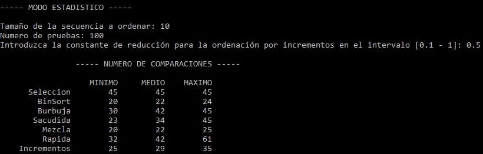
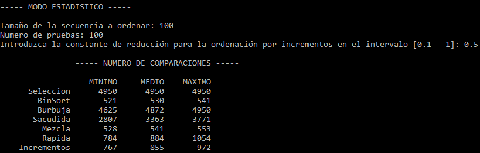
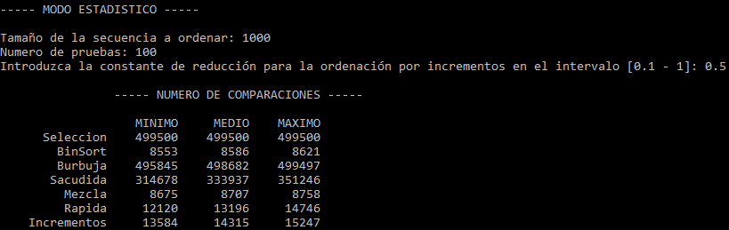
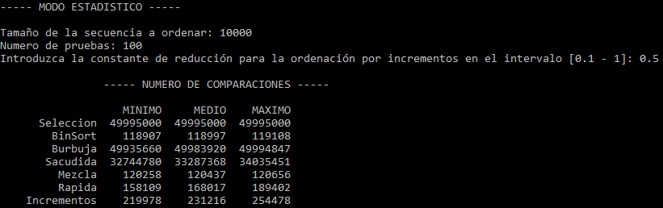

# Algoritmos y Estructuras de Datos Avanzadas

## Práctica 4: Implementación de métodos de ordenación

### Objetivo

Desarrollar en lenguaje C++ diferentes algoritmos de ordenación y realizar un análisis del rendimiento de los algoritmos implementados.

### Enunciado

Se deben implementar en lenguaje C++ los siguientes algoritmos de ordenación:

* Selección
* Por Intercambio: Método de la Sacudida
* MergeSort
* QuickSort
* Por Incrementos Decrecientes (ShellSort): debe permitir seleccionar la constante de reducción *alfa*, siendo 0 < *alfa* < 1

#### Algoritmos extra implementados

* Binaria (BinSort)
* Intercambio (Burbuja)

### Modo demostración

Se utilizan secuencias pequeñas (máximo de 25 elementos) para probar el funcionamiento de un algoritmo determinado.

El programa solicita los parámetros necesarios para su ejecución:

* *N*: Tamaño de la secuencia a ordenar.
* Algoritmo a ejecutar.

Una vez introducidos los parámetros se genera de forma aleatoria una secuencia de tamaño *N* de objetos *Matricula*.

En la ejecución del algoritmo, al pulsar una tecla, se mostrará el resultado de cada comparación, destacando los elementos del vector que son comparados y cómo queda la secuencia tras la comparación y la acción realizada.

### Modo estadístico

Para realizar el análisis del rendimiento de los métodos de ordenación es necesario contar el número de operaciones de comparación de claves que se llevan a cabo al ejecutar el algoritmo. Ésto implica utilizar un contador de comparaciones, que se inicia a cero antes del inicio de cada algoritmo y se incrementa con cada ejecución del operador de comparación de claves. Al finalizar cada algoritmo, el valor obtenido en el contador de comparaciones se utiliza para actualizar una estadística que registra los valores mínimo, máximo y media del número de comparaciones observados.

El programa realizará la siguiente secuencia de pasos:

1. Solicita los parámetros del experimento:
    * *N*: Tamaño de la secuencia a ordenar.
    * Número de pruebas, *nPruebas*. Número de veces que se repite la ejecución de cada método.

2. Para cada uno de los algoritmos se crea un banco de prueba con *nPruebas* secuencias de *N* valores de tipo *Matricula* generados de forma aleatoria.

3. El experimento para estudiar el rendimiento consiste en, para cada método de ordenación:
    * Inicializar a cero los contadores de comparaciones de claves. Valores mínimo, acumulado y máximo.
    * Realizar la ordenación de las nPruebas secuencias de *N* claves del banco de prueba. Para cada ejecución se cuenta el número de comparaciones realizadas, y se actualizan los valores mínimo, máximo y acumulado.
    * Al finalizar el experimento se presentan los valores mínimo, máximo y medio del número de comparaciones de claves contabilizados.

#### Análisis de la variación del comportamiento respecto del tamaño de las secuencias

Con el programa desarrollado, se ha realizado un análisis de la variación del comportamiento en los métodos de ordenación cuando se
incrementa el tamaño de la secuencia a ordenar. Se ha mantenido el número de pruebas *nPruebas* en 100, cantidad suficiente para obtener unos datos fiables y mitigando la aparición de datos atípicos. Además, para la ejecución del algoritmo por Incrementos Decrecientes, se ha usado un *alpha* de 0.5 en todas las pruebas. Los resultados obtenidos han sido los siguientes:

* **Tamaño de las secuencias *N* = 10**

* **Tamaño de las secuencias *N* = 100**

* **Tamaño de las secuencias *N* = 1000**

* **Tamaño de las secuencias *N* = 10000**

#### Conclusiones

Analaizando los datos obtenidos, podemos clasificar los algoritmos estudiados en las siguientes categorías:

* **Ineficientes tanto con longitudes pequeñas como grandes:**
    - Ordenación por selección (SelSort)
    - Ordenación por intercambios (BubbleSort)
    - Ordenación por el método de la sacudida (ShakeSort): podemos ver que da unos resultados ligeramente mejores que los dos anteriores, pero que, a efectos teóricos, es igual de ineficiente.

* **Ineficientes con longitudes pequeñas pero eficientes con longitudes grandes:**
    - Ordenación rápida (QuickSort): podemos ver que, con longitudes pequeñas, da unos resultados muy similares a los algoritmos del apartado anterior, pero con longitudes grandes aumenta notablemente su eficiencia.

* **Eficientes tanto con longitudes pequeñas como grandes:**
    - Ordenación por mezcla (MergeSort)
    - Ordenación por incrementos (ShellSort): podemos ver que da unos resultados ligeramente mejores que la ordenación por mezcla, pero que, a efectos teóricos, es igual de eficiente.
    - Ordenación binaria (BinSort): podemos ver que da los mejores resultados de todo el análisis.

Si tuviera que ordenar (de forma subjetiva, pero fijándome en los datos obtenidos) los diferentes algoritmos del mejor al menor, independientemente de la longitud de las secuencias a ordenar, la lista quedaría como sigue:

1. Ordenación binaria (BinSort)
2. Ordenación por mezcla (MergeSort)
3. Ordenación por incrementos (ShellSort)
4. Ordenación rápida (QuickSort)
5. Ordenación por el método de la sacudida (ShakeSort)
6. Ordenación por intercambios (BubbleSort)
7. Ordenación por selección (SelSort)

***NOTA:*** **Este análisis y sus conclusiones se basan en el número de comparaciones que realizan los diferentes algoritmos, no en el tiempo de ejecución de los mismos. Un análisis basado en el tiempo de ejecución podría dar lugar a resultados totalmente diferentes.**

### Compilación y ejecución

El ejecutable generado se guarda en *bin/*

~~~
    make run
~~~

### Información personal

**Autor:** [Kevin Estévez Expósito](https://alu0100821390.github.io/)

**ULL-ID:** alu0100821390
